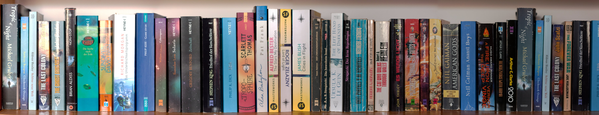

This project was bootstrapped with [Create React App](https://github.com/facebook/create-react-app).

## React 16.8.6 | useReducer, useState, useContext - simple TodoList

## Tech Stack:

1. React 16.8.6

- styled-components
- react-transition-group
- serve

### Available Scripts

In the project directory, you can run:

#### `npm start`

Runs the app in the development mode. 
Open [http://localhost:3000](http://localhost:3000) to view it in the browser.

Original prepared example from [React State with Hooks: useReducer, useState, useContext](https://www.robinwieruch.de/react-state-usereducer-usestate-usecontext/) - by Robin Wieruch

#### Other scripts:

`npm test`, `npm run build`, `npm run eject`

### Helpful Documents:

You can learn more in the [Create React App documentation](https://facebook.github.io/create-react-app/docs/getting-started).

To learn React, check out the [React documentation](https://reactjs.org/).

Code splitting has moved here: https://facebook.github.io/create-react-app/docs/code-splitting

Analyzing the Bundle Size has moved here: https://facebook.github.io/create-react-app/docs/analyzing-the-bundle-size

Making a Progressive Web App has moved here: https://facebook.github.io/create-react-app/docs/making-a-progressive-web-app

Advanced Configuration has moved here: https://facebook.github.io/create-react-app/docs/advanced-configuration

Deployment has moved here: https://facebook.github.io/create-react-app/docs/deployment

`npm run build` fails to minify has moved here: https://facebook.github.io/create-react-app/docs/troubleshooting#npm-run-build-fails-to-minify
